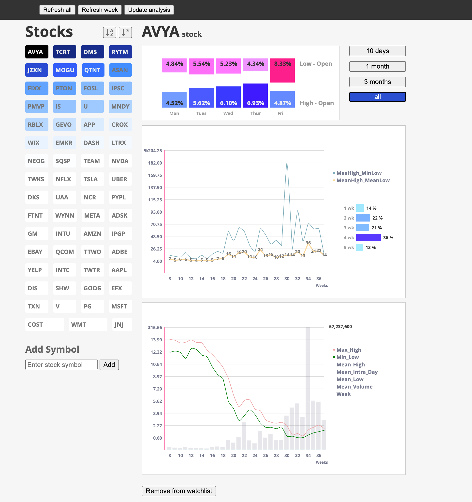

## Features
This application consists of 2 main capabilities:

- A Web server
- A standalone stock data downloader (to be discontinued in future versions)

## Operations

**Web Sever**

Starting the Web server is done by issuing the commandline instruction:

    python3 main.py --web

The server will be accessible on http://localhost:8091/

To change the port, modify the `serverPort` variable in the `main.py` file :)

**Importing Watchlist**

The Web server will require symbols. These can be added from the UI individually, which is terribly boring.

Alternatively, stock symbols can be mass upladed via the the import command:

    python3 main.py -i somefile.json

The watchlist file MUST be a *json* file with the format:

    [
        {
            "symbol": "AAPL"
        },
        {
            "symbol": "EA"
        },
        ...
        {
            "symbol": "U"
        }
    ]

NOTE: The last record does not have a trailing comma (i.e. ' , ').

I've provided a `sample_watchlist.json` file with a few stocks.

You can start by issuing the command below in your terminal:

    python3 main.py -i sample_watchlist.json

## Faceplams

- The application is not responsive.
- The charts use a non-standard charting library that I created (I don't like D3).
- The UI doesn't show any notifications when downloading new stock data.
- Errorhandling sucks.
- When using the "standalone stock data downloader", the ./WWW/data/stocks folder must exist before running the command.

## Dependencies

- Mongodb (running on `127.0.0.1:27017` - see `lib/db.py`)
- Python 3
- Pip 3

### Packages

- matplotlib
- numpy
- pandas
- pricefetch
- pymongo

